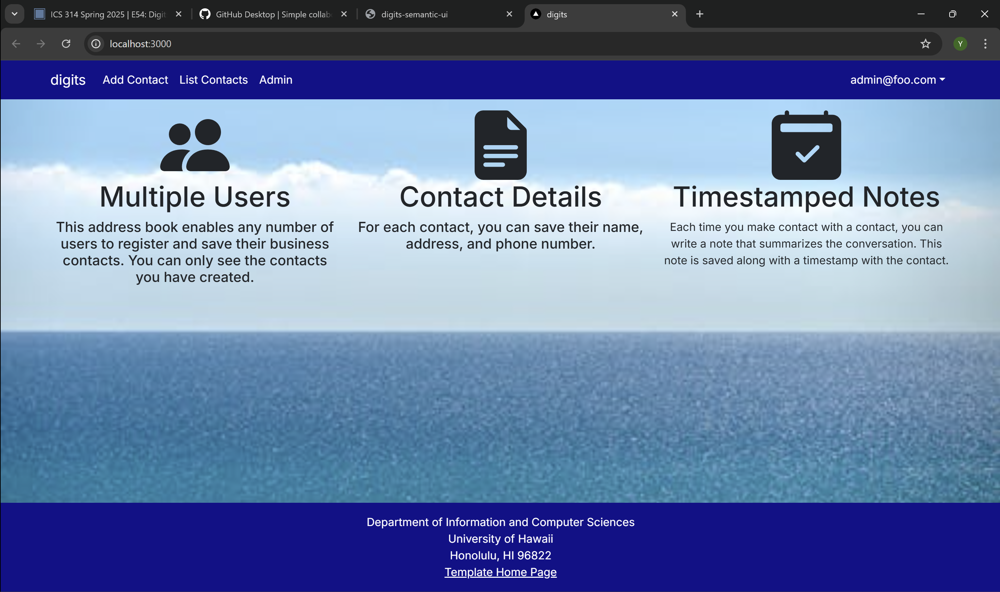
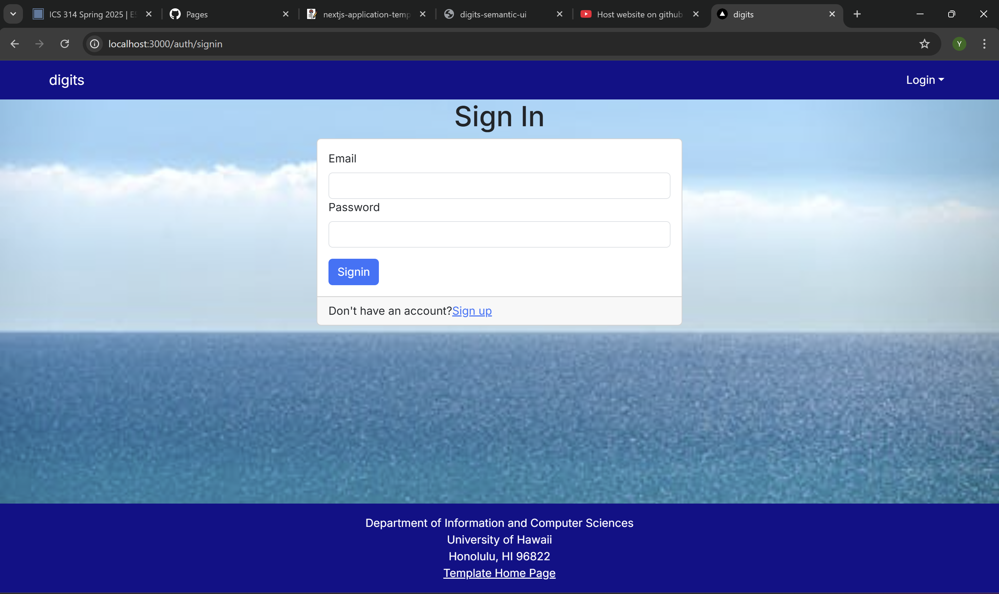
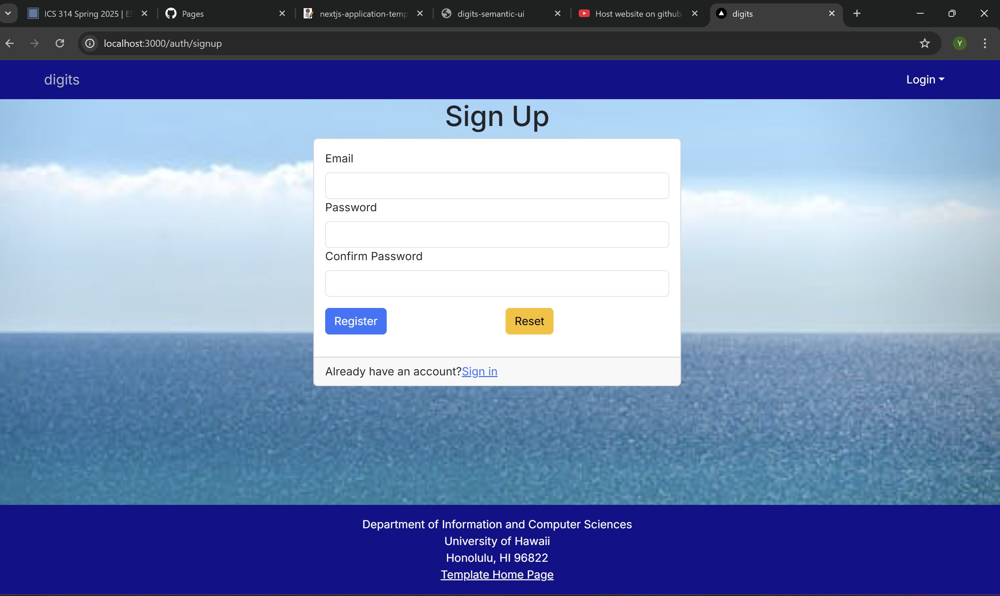
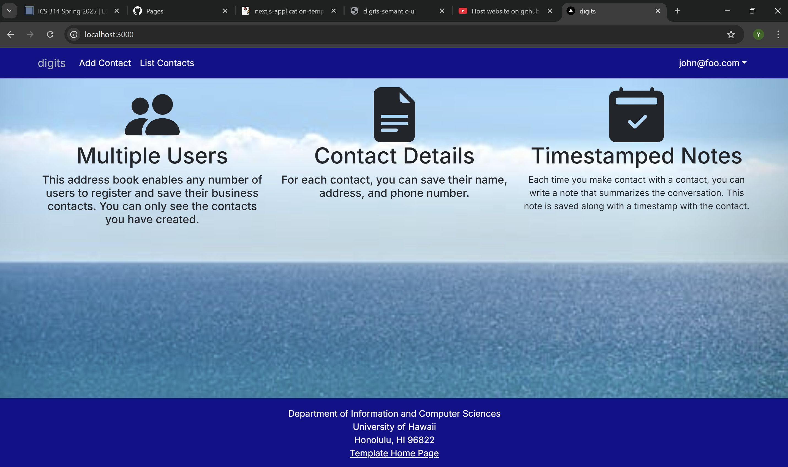
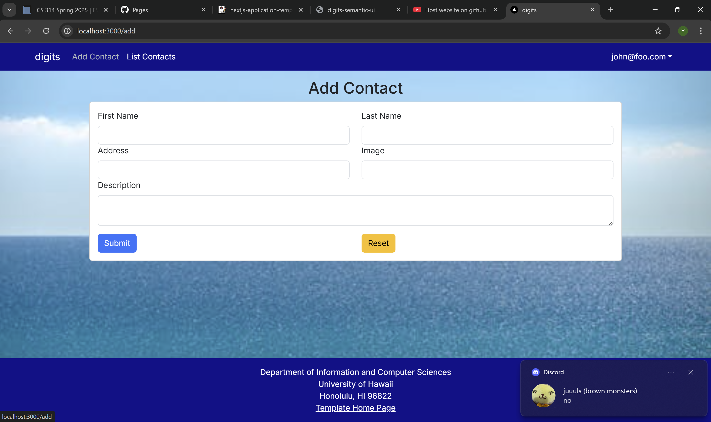
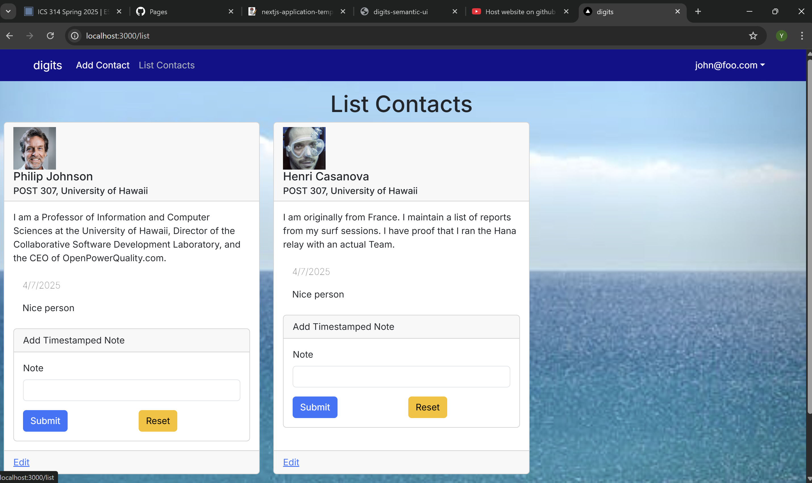
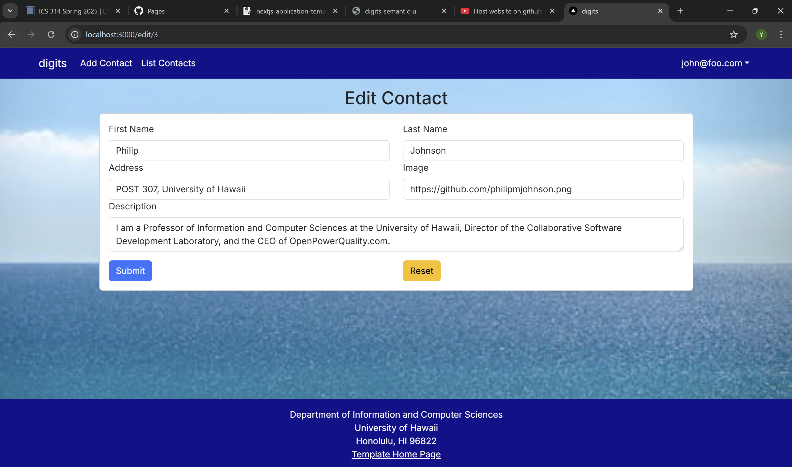

## Installation

First, [install PostgreSQL](https://www.postgresql.org/download/). Then create a database for your application.

```

$ createdb nextjs-application-template
Password:
$

```

Second, go to [https://github.com/ics-software-engineering/nextjs-application-template](https://github.com/ics-software-engineering/nextjs-application-template), and click the "Use this template" button. Complete the dialog box to create a new repository that you own that is initialized with this template's files.

Third, go to your newly created repository, and click the "Clone or download" button to download your new GitHub repo to your local file system. Using [GitHub Desktop](https://desktop.github.com/) is a great choice if you use MacOS or Windows.

Fourth, cd into the directory of your local copy of the repo, and install third party libraries with:

```

$ npm install

```

Fifth, create a `.env` file from the `sample.env`. Set the `DATABASE_URL` variable to match your PostgreSQL database that you created in the first step. See the Prisma docs [Connect your database](https://www.prisma.io/docs/getting-started/setup-prisma/add-to-existing-project/relational-databases/connect-your-database-typescript-postgresql). Then run the Prisma migration `npx prisma migrate dev` to set up the PostgreSQL tables.

```

$ npx prisma migrate dev
Environment variables loaded from .env
Prisma schema loaded from prisma/schema.prisma
Datasource "db": PostgreSQL database "<your database name>", schema "public" at "localhost:5432"

Applying migration `20240708195109_init`

The following migration(s) have been applied:

migrations/
└─ 20240708195109_init/
└─ migration.sql

Your database is now in sync with your schema.

✔ Generated Prisma Client (v5.16.1) to ./node_modules/@prisma/client in 51ms

$

```

Then seed the database with the `/config/settings.development.json` data using `npx prisma db seed`.

```

$ npx prisma db seed
Environment variables loaded from .env
Running seed command `ts-node --compiler-options {"module":"CommonJS"} prisma/seed.ts` ...
Seeding the database
Creating user: admin@foo.com with role: ADMIN
Creating user: john@foo.com with role: USER
Adding stuff: Basket (john@foo.com)
Adding stuff: Bicycle (john@foo.com)
Adding stuff: Banana (admin@foo.com)
Adding stuff: Boogie Board (admin@foo.com)

🌱 The seed command has been executed.
$

```

## Running the system

Once the libraries are installed and the database seeded, you can run the application by invoking the "dev" script in the [package.json file](https://github.com/ics-software-engineering/nextjs-application-template/blob/master/app/package.json):

```

$ npm run dev

> nextjs-application-template-1@0.1.0 dev
> next dev

▲ Next.js 14.2.4

- Local: http://localhost:3000
- Environments: .env

✓ Starting...
✓ Ready in 1619ms

```

### Viewing the running app

If all goes well, the template application will appear at [http://localhost:3000](http://localhost:3000). You can login using the credentials in [settings.development.json](https://github.com/ics-software-engineering/nextjs-application-template/blob/main/config/settings.development.json), or else register a new account.

### ESLint

You can verify that the code obeys our coding standards by running ESLint over the code in the src/ directory with:

```
$ npm run lint

> nextjs-application-template-1@0.1.0 lint
> next lint

✔ No ESLint warnings or errors
$
```

## Walkthrough

The following sections describe the major features of this template.

### Directory structure

The top-level directory structure is:

```

.github # holds the GitHub Continuous Integration action and Issue template.

config/ # holds configuration files, such as settings.development.json

doc/ # holds developer documentation, user guides, etc.

prisma/ # holds the Prisma ORM schema and seed.ts files.

public/ # holds the public images.

src/ # holds the application files.

tests/ # holds the Playwright acceptance tests.

.eslintrc.json # The ESLint configuration.

.gitignore # don't commit VSCode settings files, node_modules, and settings.production.json

```

This structure separates documentation files (such as screenshots) and configuration files (such as the settings files) from the actual Next.js application.

The src/ directory has this structure:

```

app/

  add/ # The add route
    page.tsx # The Add Contact Page

  admin/
    page.tsx # The Admin Page

  api/auth/[...nextauth]/
    route.ts # The NextAuth configuration

  auth/
    change-password/
      page.tsx # The Change Password Page

    signin/
      page.tsx # The Sign In Page

    signout/
      page.tsx # The Sign Out Page

    signup/
      page.tsx # The Sign Up / Register Page

  edit/
    page.tsx # The Edit Contact Page

  list/
    page.tsx # The List Contact Page

  not-authorized/
    page.tsx # The Not Authorized Page

  layout.tsx # The layout of the application

  page.tsx # The Landing Page

  providers.tsx # Session providers.

  components/
    AddContactForm.tsx # The React Hook Form for adding Contact.

    EditContactForm.tsx # The Edit Contact Form.

    Footer.tsx # The application footer.

    LoadingSpinner.tsx # Indicates working.

    Navbar.tsx # The application navbar.

    ContactItem.tsx # Row in the list Contact page.

    ContactItemAdmin.tsx # Row in the admin list Contact page.

  lib/

    dbActions.ts # Functions to manipulate the Postgres database.

    page-protections.ts # Functions to check for logged in users and their roles.

    prisma.ts # Singleton Prisma client.

    validationSchemas.ts # Yup schemas for validating forms.

  tests/ # playwright acceptance tests.

```

### Application functionality

The application implements a simple CRUD application for managing "Contact", which is a PostgreSQL table consisting of a name (String), a quantity (Number), a condition (one of 'excellent', 'good', 'fair', or 'poor') and an owner.

By default, each user only sees the Contact that they have created. However, the settings file enables you to define default accounts. If you define a user with the role "admin", then that user gets access to a special page which lists all the Contact defined by all users.

#### Landing page

When you retrieve the app at http://localhost:3000, this is what should be displayed:


The next step is to use the Login menu to either Login to an existing account or register a new account.

#### Login page

Clicking on the Login link, then on the Sign In menu item displays this page:



#### Register page

Alternatively, clicking on the Login link, then on the Sign Up menu item displays this page:



#### Landing (after Login) page, non-Admin user

Once you log in (either to an existing account or by creating a new one), the navbar changes as follows:



You can now add new Contact documents, and list the Contact you have created. Note you cannot see any Contact created by other users.

#### Add Contact page

After logging in, here is the page that allows you to add new Contact:



#### List Contact page

After logging in, here is the page that allows you to list all the Contact you have created:



You click the "Edit" link to go to the Edit Contact page, shown next.

#### Edit Contact page

After clicking on the "Edit" link associated with an item, this page displays that allows you to change and save it:



#### Admin page 

To provide a simple example of a "super power" for Admin users, the Admin page lists all of the Contact by all of the users:


